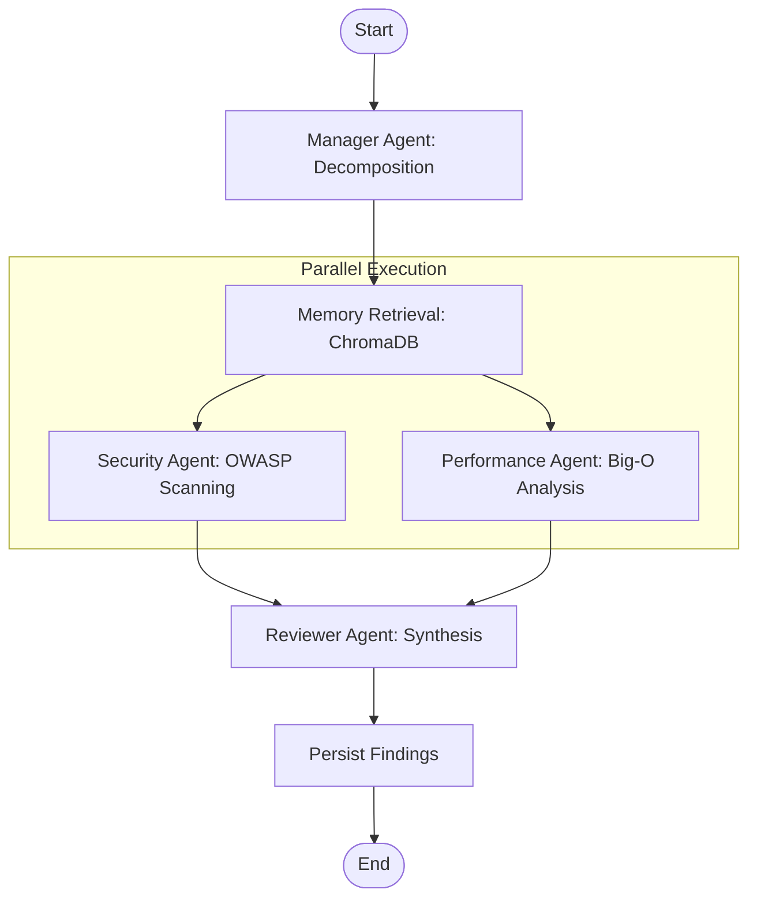

# Decentralized Multi-Agent Code Auditor

**Author:** [urumb](https://github.com/urumb)  
**Status:** Active Development

## Overview

The **Decentralized Multi-Agent Code Auditor** is a sophisticated, privacy-first static analysis tool designed to autonomously audit codebases for security vulnerabilities, performance bottlenecks, and code quality issues. 

Built on a **Modular Multi-Agent Architecture using LangGraph**, the system orchestrates a team of specialized AI agents that collaborate to decompose, analyze, and synthesize feedback on provided source code. Unlike traditional linters, it utilizes local Large Language Models (LLMs) via **Ollama** to provide semantic understanding and context-aware recommendations, while ensuring all data remains on the local machine.

## Key Features

- 🧠 **Contextual Memory**: Integrates ChromaDB to recall historical vulnerabilities and optimizations, ensuring the system "learns" from previous audits.
- ⚡ **Asynchronous Parallelism**: Leverages LangGraph to run Security and Performance scans concurrently, minimizing total audit latency.
- 🔒 **Zero-Trust Privacy**: Executes all inference locally via Ollama; no source code or audit data is ever transmitted to a third-party API.
- 📄 **Synthesis Reporting**: A dedicated Reviewer Agent aggregates multi-agent outputs into a cohesive, prioritized Markdown report.

## System Architecture

The core logic relies on a state graph where code flows through a pipeline of specialized agents.



### Technical Components

- **LangGraph**: Orchestrates the state machine and agent workflow.
- **Ollama**: Provides local inference for agents (Optimized for llama3.2).
- **ChromaDB**: Implements RAG (Retrieval-Augmented Generation) memory to recall past audit findings and ensure consistency across analysis sessions.
- **Python 3.12+**: Core runtime environment.

## Getting Started

### Prerequisites

- **Python 3.10+**
- **Ollama** running locally (`http://localhost:11434`)
- **Hardware**: Minimum 8GB RAM (Optimized for CPU-based inference).
- **Recommended Model**: llama3.2 (Selected for its high performance-to-memory ratio).

### Installation

1. **Clone the repository:**
   ```bash
   git clone https://github.com/urumb/multi-agent-auditor.git
   cd multi-agent-auditor
   ```

2. **Set up virtual environment:**
   ```bash
   python -m venv .venv

   # On Windows (PowerShell):
   .venv\Scripts\activate

   # On Linux/macOS:
   source .venv/bin/activate

3. **Install dependencies:**
   ```bash
   pip install -r requirements.txt
   ```

4. **Configure Environment:**
   ```bash
   cp .env.example .env
   # Edit .env if your Ollama instance uses a different port
   ```

## Usage

Execute the auditor by pointing it to a target file. The system will decompose the code, run parallel analysis, and generate a Markdown report alongside the source file.

```bash
python main.py path/to/your/code.py
```

### Example
```bash
python main.py vulnerable_code.py
```

## Project Standards

Development follows strict engineering guidelines detailed in [DEVELOPMENT_STANDARDS.md](./DEVELOPMENT_STANDARDS.md).
