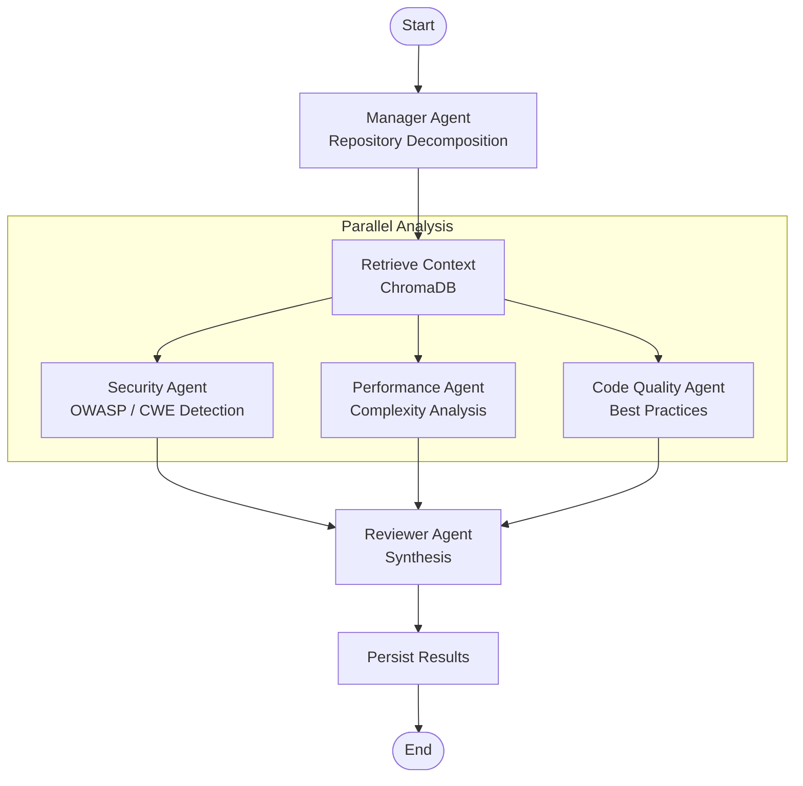

# Decentralized Multi-Agent Code Auditor


**Author:** [urumb](https://github.com/urumb)

---

## Overview

The **Decentralized Multi-Agent Code Auditor** is a privacy-first static analysis system that autonomously audits codebases for:

- Security vulnerabilities
- Performance bottlenecks
- Code quality issues

Instead of a single monolithic AI model, the system uses a **multi-agent architecture powered by LangGraph** where specialized agents collaborate to analyze code. All inference runs **entirely locally** via Ollama — source code never leaves the developer's machine.

---

## Key Features

### 🤖 Multi-Agent Code Analysis

| Agent | Responsibility |
|---|---|
| **Manager Agent** | Decomposes repositories into analyzable chunks |
| **Security Agent** | Detects OWASP vulnerabilities and exposed secrets |
| **Performance Agent** | Analyzes algorithmic complexity and inefficiencies |
| **Code Quality Agent** | Checks maintainability and best practices |
| **Reviewer Agent** | Synthesizes findings into structured reports |

### 🔒 Privacy-First Architecture

- No external APIs required
- All inference runs locally using Ollama
- Source code never leaves the machine

### ⚡ Parallel Agent Execution

Using LangGraph, security and performance analysis run **concurrently**, reducing total audit time.

### 🧠 Memory-Augmented Analysis

ChromaDB stores historical findings and retrieves relevant past results during future audits, enabling consistent recommendations across sessions.

---

## System Architecture

The audit pipeline is built as a state graph of collaborating agents.


```mermaid
graph TD
    Start([Start]) --> Manager[Manager Agent\nRepository Decomposition]
    Manager --> Memory[Retrieve Context\nChromaDB]

    subgraph Parallel Analysis
        Memory --> Security[Security Agent\nOWASP / CWE Detection]
        Memory --> Performance[Performance Agent\nComplexity Analysis]
        Memory --> Quality[Code Quality Agent\nBest Practices]
    end

    Security --> Reviewer[Reviewer Agent\nSynthesis]
    Performance --> Reviewer
    Quality --> Reviewer

    Reviewer --> Save[Persist Results]
    Save --> End([End])
```

Code is ingested by the Manager Agent, split into chunks, enriched with context from ChromaDB, then analyzed in parallel by specialized agents. The Reviewer Agent aggregates all findings into a prioritized report which is persisted for future reference.

---

## Tech Stack

### Backend
- **Python 3.10+**
- **FastAPI** — REST API layer
- **LangGraph** — agent orchestration and state machine
- **ChromaDB** — RAG memory store for historical findings
- **Ollama** — local LLM inference runtime

### Frontend
- **Next.js 14** — dashboard and UI
- **TypeScript** — type-safe components
- **TailwindCSS** — styling
- **ReactFlow** — agent graph visualization

### AI Models
- DeepSeek R1
- Llama 3
- CodeLlama

---

## Project Status

> 🚧 **Active Development**

The backend audit pipeline currently analyzes **local source files**. The frontend dashboard is operational and displays agent logs, findings, and audit progress in real time.

**Planned input types (in progress):**
- GitHub repository scanning
- Uploaded source files
- Direct code pasting

---

## ⚠️ Deployment Note

> **Important:**
> The AI agents rely on local LLMs through Ollama.
> Public deployments (e.g. Vercel) will only serve the frontend dashboard UI.
> The full analysis pipeline requires a backend running **locally** with Ollama installed and a model downloaded.

---

## Getting Started

### Prerequisites

- Python 3.10+
- Node.js 18+
- [Ollama](https://ollama.com) installed locally

---

### 1. Clone the Repository

```bash
git clone https://github.com/urumb/multi-agent-auditor.git
cd multi-agent-auditor
```

---

### 2. Backend Setup

```bash
# Create and activate virtual environment
python -m venv .venv

# macOS / Linux
source .venv/bin/activate

# Windows
.venv\Scripts\activate

# Install dependencies
pip install -r requirements.txt
```

Configure environment variables:

```bash
cp .env.example .env
# Edit .env if your Ollama instance uses a different port
```

---

### 3. Ollama Setup

```bash
# Pull a recommended model
ollama pull deepseek-coder
# or
ollama pull llama3

# Start Ollama (if not already running as a service)
ollama serve
```

---

### 4. Start the Backend

```bash
python main.py
# or
uvicorn main:app --reload
```

---

### 5. Start the Frontend

```bash
cd frontend
npm install
npm run dev
```

Open **http://localhost:3000** in your browser.

---

## Usage

Run the auditor against a local source file:

```bash
python main.py vulnerable_code.py
```

The system will:

1. Decompose the file into analyzable chunks
2. Retrieve relevant context from ChromaDB memory
3. Run Security, Performance, and Quality analysis in parallel
4. Synthesize findings via the Reviewer Agent
5. Generate a structured Markdown report

---

## Roadmap

- [ ] Repository-level analysis
- [ ] GitHub repository scanning
- [ ] File upload support
- [ ] Streaming agent logs
- [ ] Real-time audit progress visualization
- [ ] Exportable audit reports (PDF / JSON)
- [ ] Multi-language support

---

## Development Standards

Engineering guidelines and coding conventions are documented in [DEVELOPMENT_STANDARDS.md](./DEVELOPMENT_STANDARDS.md).

---

## License

MIT License

---

## Author

**urumb**  
GitHub: [https://github.com/urumb](https://github.com/urumb)