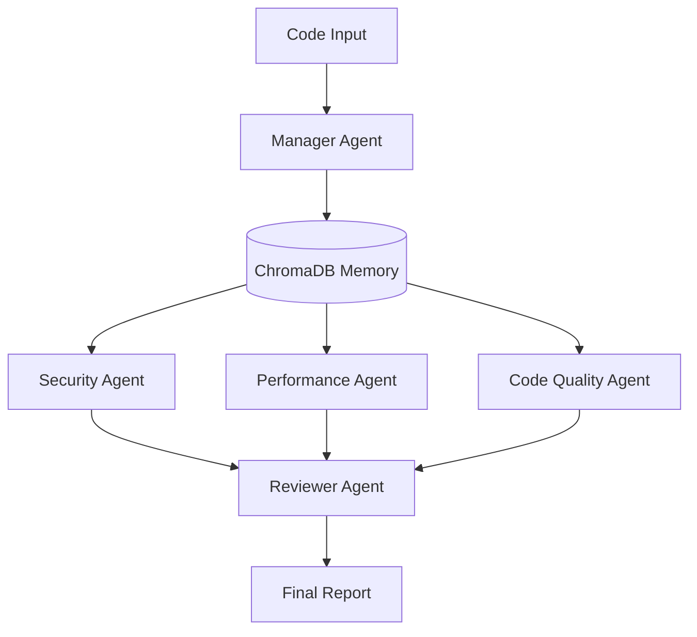

# 🚀 Decentralized Multi-Agent Code Auditor

An AI-powered, multi-agent, local-first code auditing system.

---

## ✨ Features

- 🧠 **Multi-Agent Architecture**: Collaborative agents (Manager, Security, Performance, Quality, Reviewer) orchestrated via LangGraph.
- 📦 **Multi-Input Support**: Analyze entire GitHub repositories, batch upload local files, or paste raw code directly.
- ⚡ **Real-Time Streaming**: Live execution tracking via Server-Sent Events (SSE).
- 📈 **Incremental Results**: Audit results stream into the UI precisely as each file finishes.
- 🔒 **100% Local Inference**: Powered by Ollama. Your code never leaves your machine.

---

## 🧠 How It Works


```mermaid
graph TD
    A[Code Input] --> B[Manager Agent]
    B --> C[(ChromaDB Memory)]

    C --> D[Security Agent]
    C --> E[Performance Agent]
    C --> F[Code Quality Agent]

    D --> G[Reviewer Agent]
    E --> G
    F --> G

    G --> H[Final Report]
```

---

## 🛠️ Tech Stack

**Backend**
- Python 3.12+
- FastAPI (Async endpoints & BackgroundTasks)
- LangGraph (Agent Orchestration)
- ChromaDB (Vector Store)

**Frontend**
- Next.js 14+ (App Router)
- React hooks with SSE persistence
- Tailwind CSS

**AI Models**
- Ollama (LLaMA 3.2 or DeepSeek-Coder)

---

## ⚡ Real-Time Streaming

The system leverages Server-Sent Events (SSE) to deliver real-time agent activity logs and asynchronous incremental results to the frontend.

**Example Event Stream:**
```json
data: {
  "type": "log",
  "data": {
    "agent": "Security Agent",
    "message": "Scanning for vulnerabilities...",
    "level": "info"
  }
}
```

---

## ⚙️ Setup

### 1. Clone Repository
```bash
git clone https://github.com/urumb/multi-agent-code-auditor.git
cd multi-agent-code-auditor
```

### 2. Backend Setup
```bash
python -m venv .venv

# Windows
.venv\Scripts\activate
# macOS/Linux
# source .venv/bin/activate

pip install -r requirements.txt
cp .env.example .env
```

### 3. Ollama Setup
Install [Ollama](https://ollama.com/) and run the service locally.
```bash
ollama pull llama3.2
ollama serve
```

### 4. Start the Backend
```bash
uvicorn backend.app.main:app --reload --port 8000
```

### 5. Start the Frontend
Open a new terminal window:
```bash
cd frontend
npm install
npm run dev
```

---

## 💻 Usage

1. **Dashboard**: Navigate to `http://localhost:3000/audit`.
2. **Submit Source Code**: Provide a GitHub URL, file uploads, or raw code.
3. **Execute**: Click "Run Audit".
4. **Monitor**: View live logs tracking exactly what the internal agents are analyzing. (You may safely navigate away—the audit continues running in the background and reconnects instantly upon return).
5. **Review**: Read the synthesized structural and security improvements outputted by the Reviewer Agent.

---

## 🚀 Deployment Note

- **Frontend**: Standard Node.js deployment (Vercel, Netlify, Docker).
- **Backend**: Strongly relies on local LLM capabilities. To maintain complete data privacy, the API server, ChromaDB instance, and Ollama service must all be deployed to a secured environment with adequate local compute (e.g. AWS EC2, bare-metal servers) rather than serverless functions.

---

## 📜 License

MIT License

---

## 👨‍💻 Author

**urumb**  
GitHub: [https://github.com/urumb](https://github.com/urumb)