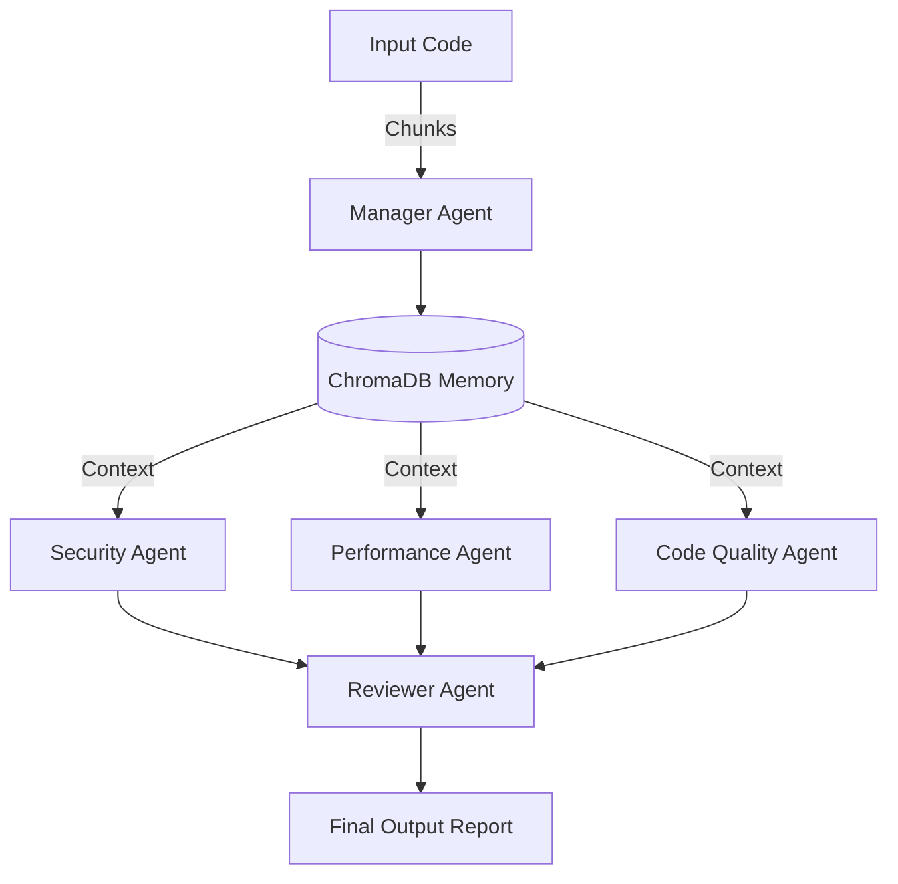

# 🚀 Decentralized Multi-Agent Code Auditor

An AI-powered, multi-agent, local-first code auditing system. It autonomously analyzes codebases for security vulnerabilities, performance bottlenecks, and code quality issues using local LLMs.

---

## ✨ Features

- 🧠 **Multi-Agent Architecture**: Specialized agents (Manager, Security, Performance, Quality, Reviewer) collaborate via LangGraph to audit code concurrently.
- 📦 **Versatile Inputs**: Seamlessly ingest GitHub repositories, upload multiple files, or paste raw code snippets.
- ⚡ **Real-Time Streaming**: Built with Server-Sent Events (SSE) to deliver live agent activity logs and incremental per-file results directly to the UI.
- 🔒 **Local-First & Private**: Runs 100% locally on your machine using Ollama. Your proprietary source code never leaves your local environment or hits external APIs.

---

## 🧠 How It Works


```mermaid
graph TD
    A[Input Code] -->|Chunks| B[Manager Agent]
    B --> C[(ChromaDB Memory)]

    C -->|Context| D[Security Agent]
    C -->|Context| E[Performance Agent]
    C -->|Context| F[Code Quality Agent]

    D --> G[Reviewer Agent]
    E --> G
    F --> G

    G --> H[Final Output Report]
```

---

## 🛠️ Tech Stack

**Backend**
- Python 3.12+
- FastAPI
- LangGraph
- ChromaDB (Local Vector Memory)

**Frontend**
- Next.js 14+ (React)
- Tailwind CSS
- Lucide Icons

**AI Models**
- Ollama (Local Inference)

---

## ⚡ Real-Time Streaming

The system utilizes Server-Sent Events (SSE) to stream live execution state from the backend agents to the frontend without the overhead of WebSockets. 

As the audit progresses, the UI receives structured JSON events for agent logs, file progress, and incremental results:

```json
{
  "type": "log",
  "data": {
    "agent": "Security Agent",
    "message": "Scanning for vulnerabilities...",
    "level": "info"
  }
}
```

---

## ⚙️ Setup Instructions

### 1. Clone the Repository
```bash
git clone https://github.com/urumb/multi-agent-code-auditor.git
cd multi-agent-code-auditor
```

### 2. Backend Setup
```bash
# Create and activate virtual environment
python -m venv .venv

# Windows (PowerShell)
.venv\Scripts\activate
# macOS / Linux
# source .venv/bin/activate

# Install dependencies
pip install -r requirements.txt

# Configure environment
cp .env.example .env
```

### 3. Ollama Setup
Ensure [Ollama](https://ollama.com/) is installed and running on your machine.
```bash
# Pull the recommended model
ollama pull llama3.2

# Ensure the Ollama service is running
ollama serve
```

### 4. Start the Backend
```bash
python -m uvicorn backend.app.main:app --reload --port 8000
```

### 5. Start the Frontend
Open a new terminal window:
```bash
cd frontend
npm install
npm run dev
```

Open **http://localhost:3000** in your browser to access the dashboard.

---

## 💻 Usage

1. **Navigate to the Dashboard**: Open `http://localhost:3000/audit`.
2. **Select Input Method**: Choose between pasting a GitHub Repository URL, uploading local files, or directly pasting code.
3. **Run Audit**: Click "Run Audit" to start the process.
4. **Monitor Live Progress**: Watch the **Agent Activity Log** to see real-time updates from individual agents as they process the codebase file by file.
5. **Review Results**: Once completed, review the comprehensive, per-file Markdown reports generated by the Reviewer Agent.

---

## 🗺️ Roadmap

- [x] Multi-agent collaboration with LangGraph
- [x] Local LLM integration (Ollama)
- [x] FastAPI REST endpoints
- [x] File upload support
- [x] GitHub repository scanning
- [x] Real-time agent streaming (SSE)
- [x] Real-time audit progress visualization
- [x] Exportable audit reports (PDF / JSON)
- [ ] Exportable audit reports (CSV)
- [ ] Multi-language syntax highlighting support

---

## 🚀 Deployment Note

- **Frontend**: Fully statically exportable and deployable on platforms like Vercel, Netlify, or standard CDNs.
- **Backend & AI**: To maintain the privacy-first architecture, the FastAPI backend and Ollama instance must be hosted on an environment capable of local LLM inference (e.g., a dedicated server, AWS EC2, or Azure VM with adequate memory/GPU resources).

---

## 📜 License

MIT License

---

## 👨‍💻 Author

**urumb**  
GitHub: [https://github.com/urumb](https://github.com/urumb)